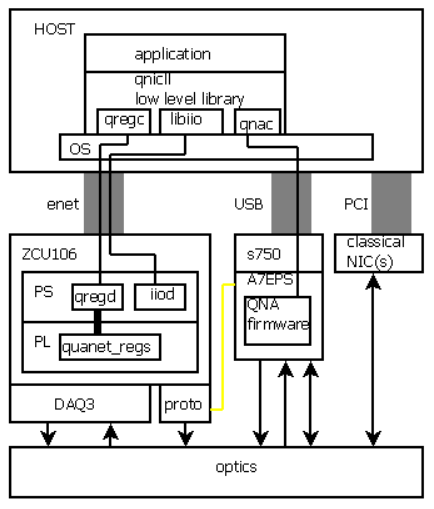

qnicll
low level lib for quanet nic

The header file is

`qnicll.h`

This fits into the qnic as shown.  It's not ideal, but it's a first step.

To move data, qnicll uses AD's libiio library.
The programmer's interface is modeled on libiio's C api,
but it's simplified somewhat for our application.

libiio communicates over ethernet to the AD iiod (iio demon).  In the PL (programmable logic) of the FPGA, "quanet regs" are the small set of registers we added in order to implement the LFSR-based probe generation, the syncronized transmit and recieve, and the synchronized driver for the fast optical switch for noise measurements.  (see library/quanet_regs).  Libiio knows nothing about these, so we wrote a demon "qregd" that mmaps the registers so they can be used.  qnicll connects to qregd to access these registers.  Eventually when we can access these registers through PCI, we can get rid of qregd.

I recently figured out how to get the zcu106 (or zc706) board to drive its USB port, so it can control the z750 board as shown.  However, when we get PCI access to the regs, a few regs could drive data over the yellow connection, and we could get rid of that USB bus.

